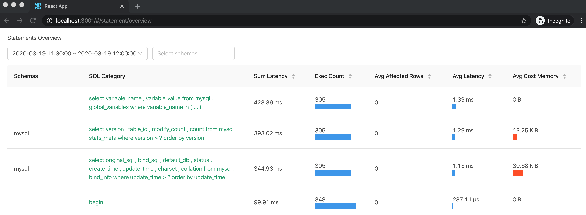
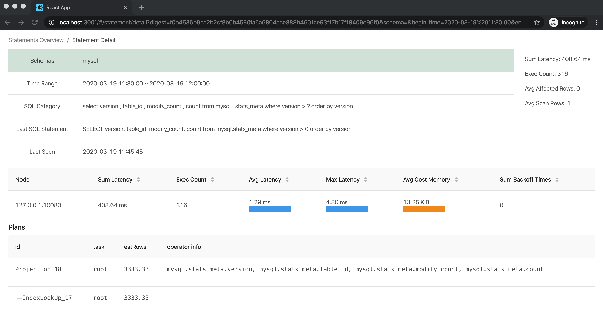
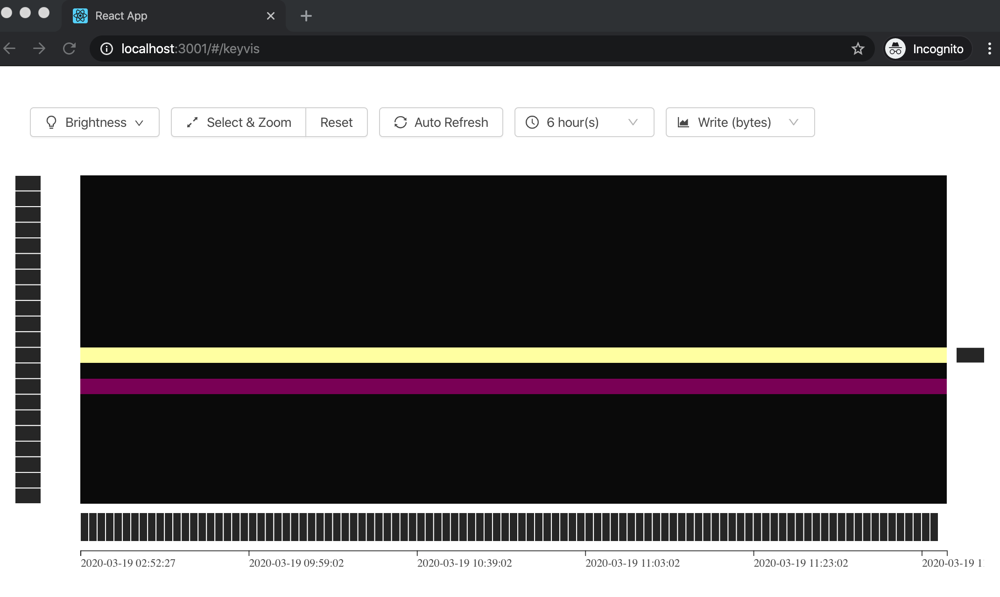

# Test TiDB-Dashboard Packages

Test the [packages](https://github.com/pingcap-incubator/tidb-dashboard/packages) published from [tidb-dashboard](https://github.com/pingcap-incubator/tidb-dashboard) repo.

Notice: this repo needs to work with the tidb-dashboard backend, see detail in tidb-dashboard [CONTRIBUTING.md](https://github.com/pingcap-incubator/tidb-dashboard/blob/master/CONTRIBUTING.md) to get how to run the backend.

## Statement

## KeyVis

